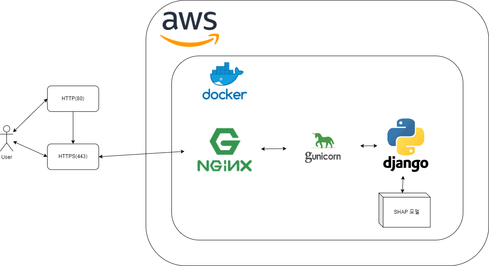

# 표 형식 데이터에 대한 딥러닝을 활용한 암 발병 예측

## 1. 프로젝트 소개
### 1.1. 배경 및 필요성
국립암센터는 향후 10년간 암 환자 수가 약 46%, 암으로 인한 사망자가 약 30% 증가할 것으로 예측했다. WHO는 암의 1/3은 예방 가능하며, 1/3은 조기 진단을 통해 완치가 가능하다고 보고했다. 조기 발견 시 위암의 5년 생존율이 90% 이상으로 크게 향상되지만, 많은 사람들이 검진을 번거롭게 여겨 정기 검진을 소홀히 하고있다. 이를 해결하기 위해 의료 기술과 인공지능(AI)을 결합한 딥러닝 기반 암 예측 모델이 주목받고 있다. 본 연구는 딥러닝을 활용한 예측 모델을 개발하여 암의 조기 발견을 돕고 암으로 인한 사망률을 줄이는 것을 목표로 한다.

### 1.2. 목표 및 주요 내용

- 표 형식 데이터에 대한 딥러닝 모델 성능 향상
  딥러닝은 오디오, 이미지와 같은 데이터에선 높은 성능을 보여주고 있지만, 표 형식 데이터에선 낮은 성능을 보인다.

- 표 형식 딥러닝에 대한 해석
  딥러닝 모델은 블랙박스 형태이기에 결과값에 대해 설명할 방법이 부족하다.

- 결과 시각화 및 데이터 분석
  암 발병 예측에 대한 결과를 시각화하고 이를 분석해 사용자에게 직관적으로 제공한다.

- 암 예측 모델 개발 및 서비스
  딥러닝 모델과 SHAP를 사용해 사용자의 건강 정보를 입력받아 암 발병 확률과 각 입력값이 예측에 미친 영향을 알수 있는 웹서비스를 개발 및 배포

## 2. 상세설계
### 2.1. 시스템 구성도



### 2.2. 사용 기술
- **Django**: 웹 프레임워크
- **Gunicorn**: WSGI HTTP 서버
- **NGINX**: 리버스 프록시 서버
- **Docker**: 프로젝트 컨테이너화
- **AWS EC2**: 서버 인스턴스 

## 3. 설치 및 사용 방법
1. **레포지토리 클론**
  ```bash
  git clone https://https://github.com/Capstone-2024-1-09/CancerPredict.git
  cd CancerPredict
  ```

2. **nginx.conf 수정**
  - 배포용 AWS EC2 IP에 맞게 nginx.conf가 작성되있으므로 사용환경에 맞는 파일수정이 필요합니다.

3. **Docker 컨테이너 실행**
  ```bash
  docker-compose up --build -d
  ```

## 4. 소개 및 시연 영상
[](https://www.youtube.com/watch?v=l7MMZJQWQFQ)

## 5. 팀 소개

최지광
- 역할: 모델 구현 및 성능 향상(MLP, FT-Transformer, GRANDE), Django를 이용한 암 발병 예측 서비스 구현, AWS를 통한 웹서비스 배포
- 이메일 : luca0328@pusan.ac.kr

송민재
- 역할: 모델 구현 및 성능 향상(LightGBM, TabNet), Django를 이용한 암 발병 설명 서비스 구현
- 이메일 : 123minjae@gmail.com

서진욱
- 역할 : 모델 구현 및 성능 향상(SAINT, RandomForest), XAI SHAP 모델 구현
- 이메일 : sju2846@naver.com
